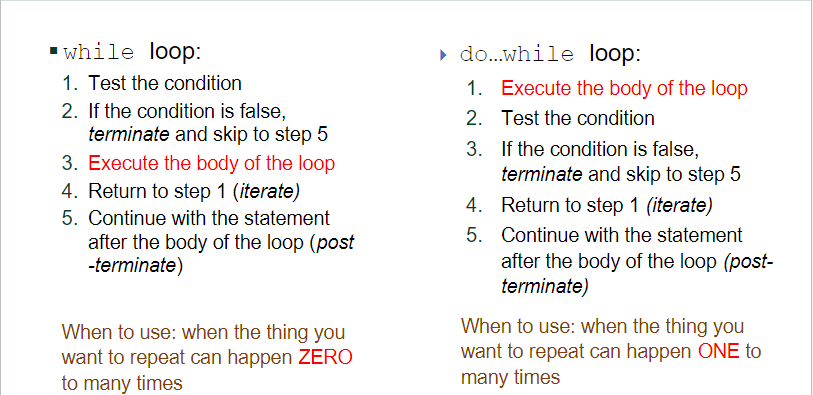

# While loops

# Indefinite Loops

For loops are great when we know how many times to repeat
 - But what if we don’t know?
 - For loop: Make 50 free throw attempts
 - Indefinite loop: Shoot until you’ve made 50 shots


## While Loops

 - The while loop is the most powerful and versatile loop in programming
 - All other loops can be rewritten as while loops

 - A `while` loop takes the following general form:
```
while (condition)    // no semi-colon, just like for loops
  {
<statement>;
<statement>;
...
<statement>;
     }
```
 - NOTE: All statements will run before the condition is checked again – it’s not always being 
checked

Execution happens in this order:
1. Test the condition
2. If the condition is false, terminate and skip to 
step 5
3. Execute the body of the loop
4. Return to step 1 (iterate)
5. Continue with the statement after the body of 
the loop (post-terminate)


```
int n = 1;
while (n < 10) 
  {
System.out.println(n*n);
n++;
}
System.out.println("Final n: " + n);
```

```
int n = 1;
while (n < 100) 
  {
System.out.println(n%10);
}
System.out.println(“Final n: “ + n);
```

The while loop has a cousin, called the do...while loop
 - A do...while loop takes the following general form:

```
do 
  {
<statement>
<statement>
...
<statement>
} while (condition);
```

 - NOTE: Do while always runs the body code AT LEAST ONCE

## Summary of Both Types of loops



 - Three main ways to use
 - Loop until done (Boolean test)
 - Loop until some value entered (sentinel)
 - Loop to handle uneven output (fence post)

## While Loops (Until Done Flavor)

 - set up/initialize the variable(s)
 - set up the loop with test
 - could be a Boolean (loop while done==false)
 - could be a test (loop while x<=5, loop while a!=b)
 - In the loop, update the variable if appropriate
 - Let the loop run until it finishes

## While Loops (Sentinel Flavor)
 - Stopping the loop when a specific input is encountered
 - Example: read in data until a specific number is entered
 - Can use a while loop, but must prompt once before the loop, 
and once inside the loop
 - Better: Can use a do...while loop and check for the sentinel 
value


#### While Loops Fence Post

 - Fence post is a good analogy for this class of problems (3 posts, 2 
sections). 
 - See pg 323-329 of book for details
 - Ex: 1,2,3,4,5   (printing this only has 4 commas)
 - Ex: |-----|-----|-----|   (print using a while loop)
 - Make sure you handle zero items correctly (an if)
 - Can solve by printing the first item outside the loop
 - Can also add an if block inside the loop to handle not printing 
another comma
 - In general, figure out what goes in the “sections” and what are the 
“posts”

## Handling Errors


 - Make sure your code handles bad data
 - Ex: You're expecting positive integers, but the user types in 
negative, or real numbers, or text
 - Ex: You're expecting a single letter (or word), but the user 
types in multiple
 - Use assertions (if input or value < 0, if == 0, if > 0)
 - Handle all possibilities

## Review About Scanners


   - Sometimes it's better to take all input as one String, then 
process its tokens with another scanner:
 - `Scanner sc = new Scanner(System.in);`
 -  Some loop to get input 
 -  `String line = sc.nextLine();`
 -  Scanner tokens = new Scanner(line);
 -  Some loop to process each token: while (tokens.hasNext())
 -  Get tokens with `.next`, `.nextInt`, etc.


# General Problem Solving in CS

 - Read and Analyze the problem
 - Write down inputs and outputs
 - Write method(s) as needed with inputs/outputs
 - Does it need a loop?
 -  Yes: Is the data being looped on a fixed/known size?
 -  Yes: Use a for loop, determine size, process data inside loop
 -  No: Use a while / do...while loop, determine condition, process data inside loop
 -  No: Analyze the logic needed, and use procedural decomposition to 
remove redundancy
 - Return or output the results